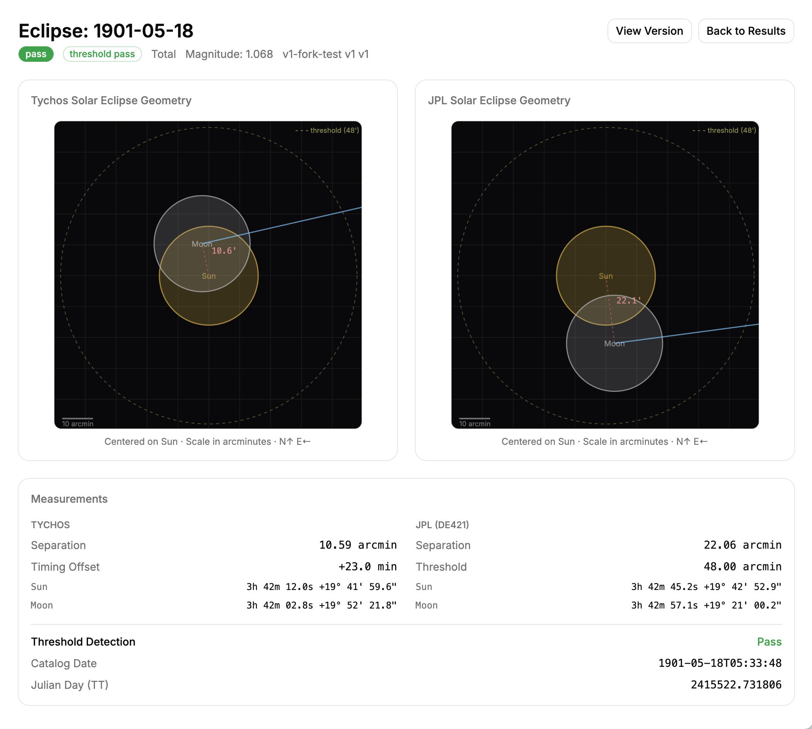
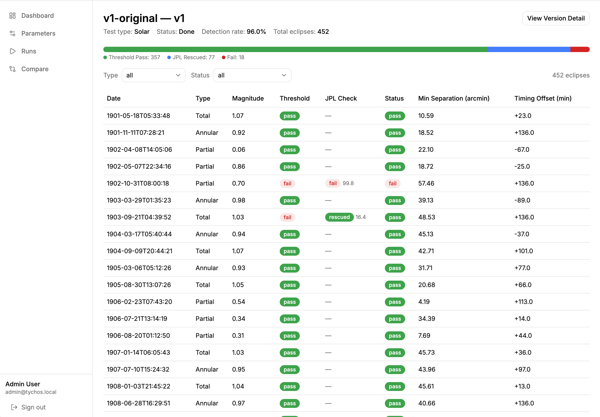
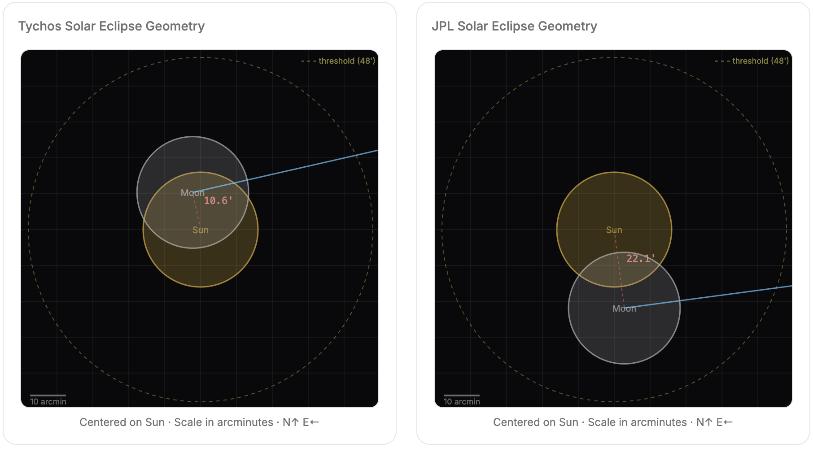
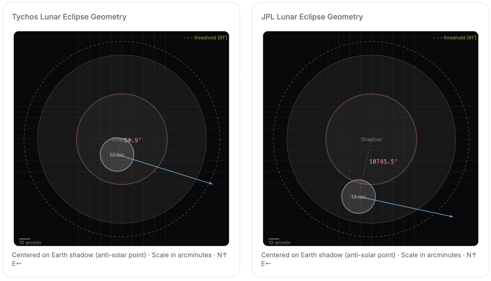

# Tychos Eclipse Prediction Test Suite





This project tests the [Tychos model](https://www.tychos.space/)'s ability to predict historical solar and lunar eclipses. For each eclipse in NASA's authoritative catalogs, it computes Sun and Moon positions in both the Tychos geometric model and the standard JPL ephemeris, derives a **predicted reference geometry** directly from the catalog's published gamma and magnitude, and reports each model's angular error against that reference.

## How It Works

1. **Get the eclipse catalogs.** Parse [NASA's Five Millennium Canon](#nasa-five-millennium-canon-of-eclipse-catalogs) of solar and lunar eclipses (1901–2100) into JSON, giving us ~500 eclipses with exact times in Julian Day (TT), plus per-eclipse `gamma`, magnitude, and Saros series number.

2. **Derive a predicted reference geometry.** For each catalog eclipse, [`server/services/predicted_geometry.py`](#predicted-reference-geometry) converts the published gamma and magnitude into the expected Sun-Moon (or Moon-to-shadow) angular separation and disk/shadow radii — pure geometry, no Skyfield, no Tychos. This becomes the per-eclipse ground-truth reference stored in the `predicted_reference` table.

3. **Set up two models via Skyfield.** Initialize the [Tychos geometric model](#tychos_skyfield-submodule) (`tychos_skyfield`) and the standard [heliocentric model](#jpl-de440s-planetary-ephemeris) (JPL DE440s ephemeris via Skyfield). Both produce Sun and Moon RA/Dec positions in the ICRF/J2000 frame.

4. **Scan each model for closest approach.** For each catalog eclipse, [scan for minimum Sun-Moon separation](#how-eclipse-detection-works) in the Tychos model around the catalog time, and record the corresponding JPL geometry at the same instant.

5. **Score against the predicted reference.** Compute `tychos_error_arcmin` and `jpl_error_arcmin` as the angular distance between each model's predicted Sun-Moon separation and the catalog-derived reference separation. There is no pass/fail — the metric is continuous.

6. **Store and visualize.** Results go into a SQLite database. The [admin dashboard](#admin-dashboard) provides per-eclipse [geometry diagrams](#visualizations) (predicted / tychos / jpl side-by-side), error-based filtering, [Saros-series grouping](#saros-analysis), and dataset browsing.

## Table of Contents

- [Dependencies](#dependencies)
- [Datasets](#datasets)
- [Predicted Reference Geometry](#predicted-reference-geometry)
- [How Eclipse Detection Works](#how-eclipse-detection-works)
- [Error Metrics](#error-metrics)
- [Visualizations](#visualizations)
- [Admin Dashboard](#admin-dashboard)
- [Saros Analysis](#saros-analysis)
- [Running the Tests](#running-the-tests)
- [Open Questions](#open-questions)
- [Future Goals](#future-goals)

---

## Dependencies

### tychos_skyfield (Submodule)

The core Tychos model implementation in Python. Included as a git submodule at `tychos_skyfield/`.

- **`baselib.py`** — The complete Tychos solar system model. Implements `TychosSystem`, which positions all planets (Sun, Moon, Mercury through Neptune, and several minor bodies) using the Tychos geometric model with deferent/epicycle-style orbital mechanics. Computes RA/Dec in the ICRF/J2000 frame. Orbital parameters are loaded from `orbital_params.json`, which is synced from the TSN (Tychosium) JavaScript 3D simulator's `celestial-settings.json`.

- **`skyfieldlib.py`** — An adapter that wraps Tychos objects as [Skyfield](https://rhodesmill.org/skyfield/) `VectorFunction` objects, allowing Tychos-computed positions to be used interchangeably with JPL ephemeris data within the Skyfield API. This enables direct RA/Dec comparisons between Tychos and the standard (heliocentric) model.

**Source:** Private submodule (contact the Tychos project for access)

### Skyfield

[Skyfield](https://rhodesmill.org/skyfield/) is a Python library for positional astronomy by Brandon Rhodes. It computes positions of stars, planets, and satellites using high-accuracy numerical data from NASA's Jet Propulsion Laboratory (JPL).

- **Used for:** Computing JPL reference positions of the Sun and Moon at each catalog eclipse time, serving as the "standard model" baseline for comparison.
- **Ephemeris file:** [`de440s.bsp`](https://naif.jpl.nasa.gov/pub/naif/generic_kernels/spk/planets/) — The compact version of JPL's DE440 planetary ephemeris, covering 1849–2150 CE.
- **Reference:** [rhodesmill.org/skyfield](https://rhodesmill.org/skyfield/)
- **PyPI:** [skyfield](https://pypi.org/project/skyfield/)

### NumPy

Used throughout for trigonometric calculations (angular separation, coordinate transforms) and array operations.

- **Reference:** [numpy.org](https://numpy.org/)

### SciPy

Used in `baselib.py` for `scipy.spatial.transform.Rotation` — 3D rotation algebra for orbit tilts, coordinate frame transformations, and RA/Dec computation from Cartesian positions.

- **Reference:** [scipy.org](https://www.scipy.org/)

### FastAPI + aiosqlite

The admin server uses [FastAPI](https://fastapi.tiangolo.com/) for the API layer and [aiosqlite](https://pypi.org/project/aiosqlite/) for async SQLite access. Results are stored in `results/tychos_results.db`.

---

## Datasets

Eclipse catalogs are first-class entities in the database. The `datasets` table stores each catalog with a stable `slug`, human-readable `name`, `description`, and `source` URL. Every eclipse, run, result, and predicted reference row is keyed off `dataset_id` (replacing the older free-form `test_type` string). The admin UI exposes a **Datasets** list page and a per-dataset detail page that browses every eclipse in the catalog with its predicted geometry diagram and Saros context.

### NASA Five Millennium Canon of Eclipse Catalogs

The ground truth for eclipse occurrence comes from NASA's Goddard Space Flight Center eclipse catalogs compiled by Fred Espenak and Jean Meeus. These are the canonical reference catalogs used by the astronomy community.

**Solar eclipses (1901–2100):**
- [SE1901-2000.html](https://eclipse.gsfc.nasa.gov/SEcat5/SE1901-2000.html)
- [SE2001-2100.html](https://eclipse.gsfc.nasa.gov/SEcat5/SE2001-2100.html)

**Lunar eclipses (1901–2100):**
- [LE1901-2000.html](https://eclipse.gsfc.nasa.gov/LEcat5/LE1901-2000.html)
- [LE2001-2100.html](https://eclipse.gsfc.nasa.gov/LEcat5/LE2001-2100.html)

**Reference:** Espenak, F. and Meeus, J., [Five Millennium Canon of Solar Eclipses: -1999 to +3000](https://eclipse.gsfc.nasa.gov/SEpubs/5MCSE.html), NASA/TP-2006-214141

The script `scripts/parse_nasa_eclipses.py` fetches these HTML pages, extracts the fixed-width tabular data from `<pre>` blocks, parses each record's date/time, eclipse type, and magnitude, converts the timestamp to Julian Day (Terrestrial Time), and writes the result to `tests/data/solar_eclipses.json` and `tests/data/lunar_eclipses.json`.

Each record contains:
- `julian_day_tt` — Julian Day in Terrestrial Time (TT), the time scale used by the catalog
- `date` — ISO 8601 date/time string
- `type` — Normalized eclipse type (`total`, `annular`, `partial`, `hybrid`, `penumbral`)
- `magnitude` — Eclipse magnitude from the catalog
- `gamma` — Minimum distance of the shadow axis from Earth's center, in Earth radii (signed)
- `saros_num` — Saros series number, used for [series-level analysis](#saros-analysis)

### JPL DE440s Planetary Ephemeris

For each catalog eclipse, we compute the Sun and Moon positions as predicted by the standard heliocentric model using JPL's DE440 ephemeris via Skyfield. This provides an independent "where should the Sun and Moon actually be?" reference.

- **File:** `de440s.bsp` (compact version, auto-downloaded by Skyfield on first use)
- **Coverage:** 1849–2150 CE
- **Accuracy:** Sub-arcsecond for inner solar system bodies
- **Reference:** Park, R.S., et al., [The JPL Planetary and Lunar Ephemerides DE440 and DE441](https://doi.org/10.3847/1538-3881/abd414), The Astronomical Journal, 2021

The JPL data is precomputed at seed time (`server/seed.py`) and stored in the `jpl_reference` table, including Sun RA/Dec, Moon RA/Dec, Moon RA/Dec velocity, and angular separation — all computed at each catalog eclipse's Julian Day using Skyfield's `earth.at(t).observe()` method in the ICRF/J2000 frame.

---

## Predicted Reference Geometry

[`server/services/predicted_geometry.py`](server/services/predicted_geometry.py) turns each catalog record into the geometry that *should* hold at the moment of maximum eclipse, using only the published `gamma` and magnitude (no Skyfield, no Tychos):

- **Expected Sun-Moon (or Moon-to-shadow) separation** is derived from gamma — the perpendicular distance of the shadow axis from Earth's center, in Earth radii — by projecting it onto the celestial sphere at the mean Earth-Moon distance.
- **Solar disk radii** for central eclipses (total/annular/hybrid) come from the magnitude directly: `magnitude = D_moon / D_sun`, so `R_moon = magnitude × R_sun_mean`. Partial eclipses fall back to the mean lunar radius.
- **Lunar shadow radii** are inverted from umbral and penumbral magnitudes plus the gamma-derived Moon-to-shadow distance, recovering the umbral and penumbral radii implied by the catalog rather than treating them as constants.
- **Approach angle** is taken from the sign of gamma adjusted for the ecliptic tilt (~23.44°), so the predicted diagram shows the Moon entering from the geometrically correct side.

The result is precomputed at seed time into a `predicted_reference` table (one row per eclipse) and serves as the per-eclipse ground truth for both the Tychos and JPL pipelines.

## How Eclipse Detection Works

### Core Principle

An eclipse occurs when the Sun and Moon (or Moon and Earth's shadow) are very close together on the celestial sphere as seen from Earth. We compute the closest approach in each model and compare it to the catalog-derived expected separation.

### Solar Eclipse Detection

For each solar eclipse in the NASA catalog:

1. **Move the Tychos system** to the catalog's Julian Day (TT)
2. **Two-pass scan** around that time to find the minimum Sun-Moon angular separation:
   - **Coarse pass:** Step through a ±2 hour window in 5-minute increments
   - **Fine pass:** Step through ±10 minutes around the coarse minimum in 1-minute increments
3. **Compute angular separation** between the Tychos-predicted Sun and Moon positions using the [Vincenty formula](https://en.wikipedia.org/wiki/Great-circle_distance#Formulas) (numerically stable for both small and large angles)
4. **Record the minimum** as the model's predicted Sun-Moon separation for that eclipse, along with the timing offset from the catalog moment

### Lunar Eclipse Detection

For each lunar eclipse in the NASA catalog:

1. **Compute the anti-solar point** (Earth's shadow center): RA = Sun RA + π, Dec = −Sun Dec
2. **Two-pass scan** (same coarse/fine strategy) to minimize the Moon-to-antisolar-point separation
3. **Record the minimum** as the model's predicted Moon-to-shadow separation

**Why separation-based detection works:** Eclipse geometry is fundamentally about angular proximity on the celestial sphere. A solar eclipse requires the Moon to transit across the solar disk (small Sun-Moon separation). A lunar eclipse requires the Moon to enter Earth's shadow cone, which projects to a roughly circular region opposite the Sun. By measuring angular separation, we reduce a complex 3D alignment problem to a single scalar that directly corresponds to the physical eclipse condition. This is the same basic approach used by professional eclipse prediction codes, though they additionally account for parallax, limb corrections, and exact shadow geometry.

### What the Two-Pass Scan Accounts For

The NASA catalog provides eclipse times in Terrestrial Time, but the Tychos model may have small timing offsets in when it predicts closest approach. The scan window (±2 hours coarse, ±10 minutes fine) accommodates timing differences while the `timing_offset_min` field records exactly how far off the model's best alignment is from the catalog time. This offset itself is a useful accuracy metric.

---

## Error Metrics

Eclipse results are scored as continuous angular errors against the catalog-derived [predicted reference](#predicted-reference-geometry). There are no thresholds and no pass/fail buckets — every result is just a number in arcminutes.

For each eclipse, the worker records:

- **`tychos_error_arcmin`** — `|tychos_separation − predicted_separation|`, in arcminutes. How far off the Tychos-model closest approach is from the geometry implied by the catalog's gamma/magnitude.
- **`jpl_error_arcmin`** — the same comparison computed from the JPL DE440s ephemeris at the catalog moment. This calibrates how well the *standard* heliocentric model matches the catalog reference, and serves as a floor for what "good" looks like.
- **`timing_offset_min`** — how far the Tychos minimum-separation moment sits from the catalog time.

The dashboard surfaces these as **mean tychos error** and **mean jpl error** at the run, dataset, and Saros-series level, with filterable error ranges in the results table.

### Why Compare Against a Catalog-Derived Reference?

The earlier version of this project used a hand-picked Sun-Moon separation threshold and a "JPL rescue" rule that flipped near-misses to pass. Both were arbitrary cutoffs on what is fundamentally a continuous quantity, and they obscured the actual size of the disagreement. Scoring directly against a geometry derived from the catalog's own gamma and magnitude removes the cutoffs, makes the metric monotonic with model accuracy, and lets us compare Tychos and JPL on identical footing — JPL is no longer the reference, it's another contestant being measured against the same catalog truth.

---

## Visualizations

The admin dashboard renders eclipse geometry as inline SVGs.

### Eclipse Geometry Diagram (per-result detail page)

Each eclipse result page shows three side-by-side diagrams: **Predicted** (catalog-derived) on the left, **Tychos** in the middle, and **JPL** on the right. The same predicted diagram is also shown on each catalog detail page (under the dataset browser), so you can inspect the expected geometry of any eclipse without running a model.

**Solar eclipses** are centered on the Sun:



- A yellow circle represents the Sun's disk (radius from catalog magnitude when available, otherwise the mean ~16 arcminute solar radius)
- A gray circle represents the Moon's disk
- A dashed red line connects Sun center to Moon center with the separation labeled
- An arrow on the Moon shows its velocity direction (RA/Dec velocity extrapolated over 3 hours)
- Grid lines at 10-arcminute intervals provide scale

**Lunar eclipses** are centered on the anti-solar point (Earth's shadow):



- A dark gray filled circle represents the umbral shadow (radius derived from the catalog's umbral magnitude and gamma)
- A lighter gray circle represents the penumbral shadow (derived from the penumbral magnitude)
- The Moon disk, separation line, and velocity arrow are drawn identically

The predicted diagram is rendered from the [predicted reference geometry](#predicted-reference-geometry) alone. The Tychos and JPL diagrams use positions computed from `tychos_skyfield` and `de440s.bsp` respectively at the catalog moment, so all three can be visually compared against the same geometry.


---

## Admin Dashboard

The web-based admin interface (`admin/` + `server/`) provides:

- **Parameter management** — Create, edit, version, and fork orbital parameter sets
- **Run management** — Queue eclipse test runs against any parameter version and dataset; a background worker executes them
- **Datasets browser** — List of every catalog (slug, name, description, source) with a per-dataset detail page that walks through every eclipse and its predicted geometry
- **Results browsing** — Paginated tables with error columns (`tychos_error_arcmin`, `jpl_error_arcmin`), filtering by catalog type, error range, and Saros series. Aggregate error stats live-update as filters change.
- **Stats bar** — Mean Tychos and JPL error across the current filter, replacing the old pass/fail breakdown
- **Comparison view** — Side-by-side diff of two parameter versions using error metrics, plus a Saros analysis card highlighting series-level differences
- **Per-result detail** — Three-diagram layout (predicted / Tychos / JPL), position readouts, error metrics, and a Saros context card showing position in series and chronological neighbors

## Saros Analysis

The [Saros cycle](https://en.wikipedia.org/wiki/Saros_(astronomy)) is the ~18-year periodicity that produces families of geometrically similar eclipses. Each NASA catalog record carries a `saros_num`, and the dashboard exposes that as a first-class lens on results:

- **Filter by series** — Any results table or dataset page can be narrowed to a single Saros series via the `saros` query param.
- **Group by Saros** — A dedicated view aggregates a run's results by `saros_num`, returning per-series counts, year span, and mean/max Tychos and JPL error, sorted worst-first so systematic series-level errors surface immediately.
- **Saros context card** — Result and catalog detail pages show the eclipse's position within its series (e.g. "12 of 71"), the series year span, and ±5 chronological neighbors for quick navigation.
- **Saros card on the compare page** — When diffing two parameter versions, a Saros card highlights which series moved most.

Series-level analysis is the cleanest way to spot systematic model errors that follow eclipse periodicity rather than per-eclipse noise.

---

## Running the Tests

### Prerequisites

```bash
pip install numpy scipy skyfield
```

### Standalone CLI (original test runner)

```bash
# Run all parameter sets
python tests/run_eclipses.py

# Run a specific parameter set
python tests/run_eclipses.py params/v1-original.json

# Force re-run
python tests/run_eclipses.py --force
```

### Unit tests

```bash
pytest tests/test_smoke.py -v
```

### Regenerate eclipse catalogs from NASA

```bash
python scripts/parse_nasa_eclipses.py
```

### Admin server

```bash
# Set credentials
export TYCHOS_ADMIN_USER=admin@tychos.local
export TYCHOS_ADMIN_PASSWORD=your_password

# Start the server (runs migrations, seeds JPL data on first launch)
python -m server.app
```

---

## Open Questions

### Accuracy and Calibration

1. **Predicted reference fidelity.** The catalog-derived predicted geometry uses mean Earth-Moon distance and clamps lunar shadow radii to reasonable minimums. Eclipses near apogee/perigee or with extreme gamma may have predicted separations that differ from the true geometry by amounts comparable to the model errors we're trying to measure. A sensitivity study against a higher-fidelity geometry (e.g. Besselian elements) would quantify this.

2. **Timing offset distribution.** The timing offsets recorded for each result (how many minutes the Tychos minimum-separation moment differs from the catalog time) have not been rigorously analyzed for systematic bias. A consistent positive or negative offset could indicate a drift in the model's time calibration.

3. **Partial-eclipse moon radius fallback.** For partial solar eclipses, magnitude does not directly give the lunar disk radius, so the predicted geometry falls back to a mean lunar radius. This may bias the predicted disk geometry (and thus the visual diagram) for partial events, even though the separation calculation itself is unaffected.

### Dependencies and Data Integrity

4. **DE440s vs. DE421.** The JPL reference data uses `de440s.bsp` (DE440, 2021), while `skyfieldlib.py` examples reference `de421.bsp` (DE421, 2008). DE440 incorporates more recent data and is more accurate, but this means the Skyfield adapter examples and the test infrastructure use different ephemeris versions. It has not been verified whether this difference is material for Sun/Moon positions in the 1901–2100 range.

5. **TT vs. UTC ambiguity.** The NASA catalogs provide times in Terrestrial Time (TT). The `baselib.py` Julian Day reference epoch comment says "2000-6-21 12:00:00" without specifying the time scale. The `skyfieldlib.py` adapter passes `t.tt` (Terrestrial Time) to `move_system()`, which appears correct, but the chain from catalog → JSON → Tychos model should be audited to confirm no ΔT correction is being double-applied or dropped.

6. **Vincenty formula edge cases.** The angular separation uses the Vincenty formula, which is well-behaved for small angles (unlike the cosine formula). However, the implementation has not been tested against a reference implementation for edge cases near the poles or at exactly 0°/180° separation beyond the basic smoke tests.

### Model Questions

7. **J2000 quaternion hardcoding.** The `baselib.py` RA/Dec calculation uses a hardcoded quaternion (`[-0.1420..., 0.6927..., -0.1451..., 0.6919...]`) for the J2000 epoch frame transformation. The code comments state this was "obtained by manually getting rotation quaternion of polar axis for the date 2000/01/01 12:00." The derivation of this quaternion and its sensitivity to the polar axis model parameters have not been independently verified.

8. **Parameter sensitivity.** The system supports multiple parameter sets, but the relationship between individual orbital parameters (orbit radius, tilt, speed, center offsets) and eclipse detection accuracy has not been systematically mapped. Small changes to Moon deferent parameters likely dominate eclipse detection, but this hasn't been quantified.

---

## Future Goals

1. **Verify Skyfield and tychos_skyfield accuracy.** Confirm that both the Skyfield/JPL pipeline and the tychos_skyfield Python model produce positions with sufficient accuracy for meaningful comparison. This means validating Skyfield output against known reference positions and ensuring tychos_skyfield faithfully reproduces the Tychosium JavaScript simulator's results.

2. **Verify eclipse catalog data.** Audit the NASA Five Millennium Canon eclipse data to confirm it is reliable and high-accuracy — that the eclipse times, types, and magnitudes we are testing against are themselves trustworthy. Cross-reference against independent sources (e.g., Meeus's tables, USNO data) where possible.

3. **Automated parameter optimization.** With a continuous, catalog-grounded error metric now in place, brute-force search for Tychos orbital parameters that minimize mean Tychos error becomes well-defined. Next step is a fast-enough evaluation loop to make large parameter sweeps practical.

4. **Test against additional celestial events.** Extend beyond eclipses to other observable phenomena that constrain the model: planetary conjunctions, oppositions, transits of Mercury and Venus, lunar occultations of bright stars, and solstice/equinox timing.

5. **Live Tychosium preview with modified parameters.** Add a way to load modified parameter sets into the Tychosium 3D simulator so that the visual effect of parameter changes can be inspected interactively, not just measured numerically.
